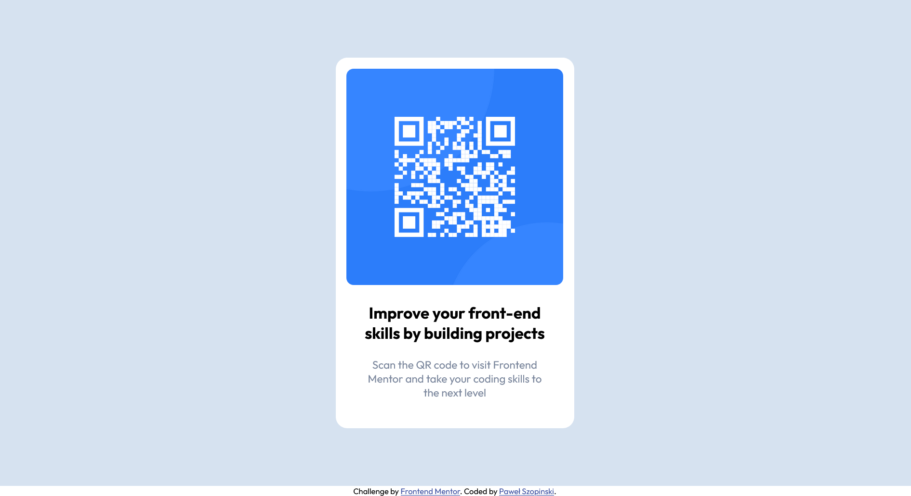

# Frontend Mentor - QR code component solution

This is a solution to the [QR code component challenge on Frontend Mentor](https://www.frontendmentor.io/challenges/qr-code-component-iux_sIO_H). Frontend Mentor challenges help you improve your coding skills by building realistic projects.

## Table of contents

- [Overview](#overview)
  - [Screenshot](#screenshot)
  - [Links](#links)
- [My process](#my-process)
  - [Built with](#built-with)
  - [What I learned](#what-i-learned)
  - [Useful resources](#useful-resources)
- [Author](#author)

## Overview

The very first project of mine in the Frontend Mentor Community. I thaught it will take me an hour to do it. It ended up in three.

### Screenshot

### Links

- Solution URL: [Add solution URL here](https://your-solution-url.com)
- Live Site URL: [Add live site URL here](https://pawelszopinski.github.io/qr-code-femc-beginner/)

## My process

I am starting without subscription so I ended up guessing margins etc. according to .jpg design images. Hope I guessed right.

### Built with

- Semantic HTML5 markup
- CSS custom properties

### What I learned

I learned that warking in a team is different than working solo on the project. Communication and task priorities are crucial!

### Useful resources

- [CSS Default Browser Values](https://www.w3schools.com/csSref/css_default_values.php) - This helped me to find default margin that was stretching my body tag. I really liked this site and will use it going forward.

## Author

- GitHub - [Paweł Szopinski](https://github.com/pawelszopinski)
- Frontend Mentor - [@pawelszopinski](https://www.frontendmentor.io/profile/pawelszopinski)
